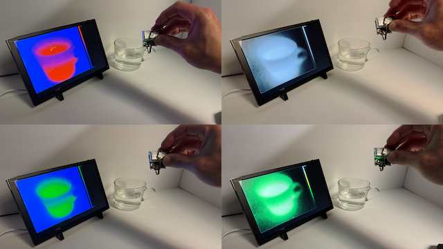

# 🔥 ESP32 Thermal Camera Viewer with Node.js Web Interface

This project enables real-time thermal frame streaming from an ESP32-based thermal imaging camera (MI0802) to a web browser via TCP and WebSocket. It features a full-screen heatmap viewer, FPS tracking, temperature overlays, and charting.


<div align="center">

[](https://youtu.be/uJirSqlyhA4)
<p>ESP32 Thermal Camera powered by 3.7V Li-Po Battery</p>
</div>

---

## 📁 Project Structure

```
ESP32_Thermal_Camera/
├── senxorESP32S3/        # ESP32-S3 firmware (ESP-IDF)
├── Node_Thermal_TCP/     # Node.js TCP Client + Web UI
└── README.md
```

---

## 🚀 ESP32 Firmware (ESP-IDF)

### The ESP32 source code has been modified based on the code provided by Waveshare. Please note that all rights to the code belong to Waveshare, which provides this code.


### ✅ Requirements
- Waveshare Thermal-Camera-ESP32-Module [https://www.waveshare.com/wiki/Thermal-Camera-ESP32-Module]
- **ESP-IDF version 5.2.x only**

### 🔧 Setup Instructions

1. Navigate to the ESP32 project folder:

```bash
cd senxorESP32S3
```

2. Configure the firmware:

```bash
idf.py menuconfig
```

- 🔐 **Important:**  
  Set your Wi-Fi SSID and password via `Example Configuration` menu.

3. Flash the firmware:

```bash
idf.py build
idf.py flash monitor
```

> ✅ Ensure your ESP32 connects to Wi-Fi and starts its TCP server on port `3333`.

---

## 💻 Node.js Web Viewer

### ✅ Requirements

- Node.js v16 or later
- A modern browser (Chrome, Edge, Firefox)

### 📦 Setup Instructions

1. Go to the Node.js project folder:

```bash
cd Node_Thermal_TCP
```

2. Install dependencies:

```bash
npm install
```

3. Open `client.js` and **edit the ESP32 IP address**:

```js
const ESP32_HOST = "192.168.x.x"; // ← Your ESP32's local IP
```

> ⚠️ **Be sure to update this!** Otherwise TCP connection will fail.

4. Start the client:

```bash
node client.js
```

5. Visit the web viewer in your browser:

```
http://localhost:8080
```

---

## 🌐 Features

- 🔥 Real-time 80x62 thermal frame rendering
- 🖼 Fullscreen view with canvas scaling
- 🧊 Color map presets: Inferno, Plasma, Hot, Fire & Ice, etc.
- 📈 Live min/max temperature graph
- 🎯 Max temperature overlay + label
- 🧭 Vertical range bar with color matching
- 💾 Screenshot saving
- ↔ Flip left-right toggle
- 🌡 Celsius / Fahrenheit support

---

## 📄 License

MIT License © 2025 That Project Vision Labs
